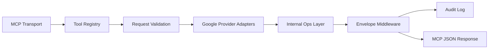

# Google-Only MCP Server Implementation Plan

## Goal

Ship a production-usable MCP server for `gogcli-enhanced` that exposes Google operations with stable machine contracts, while reusing existing command/ops primitives and avoiding premature multi-provider abstractions.

## Scope Boundaries

- In scope: Google services only (Docs, Sheets, Slides, Drive initial set).
- Out of scope: Zoho/provider-specific functionality.
- Compatibility requirement: no breaking changes to existing CLI UX.

## Principles

- JSON-only tool responses for MCP.
- Stable `error_code` values and deterministic envelope fields.
- First-class `opId` and `requestHash` for traceability/replayability.
- Plan/execute workflow for mutating operations.
- Reuse internal logic; avoid duplicating business behavior in MCP wrappers.

## Target Architecture

## Contract Model (v1)

All MCP tool responses should follow one shape:

- Success
  - `ok: true`
  - `service`
  - `operation`
  - `opId` (if provided)
  - `requestHash` (when request payload exists)
  - `result` (service-specific)
- Failure
  - `ok: false`
  - `service`
  - `operation`
  - `opId` (if provided)
  - `error.code` (stable machine code)
  - `error.message`
  - `error.details` (optional)

Stable error code set for v1:

- `invalid_argument`
- `not_found`
- `auth_failed`
- `permission_denied`
- `rate_limited`
- `timeout`
- `conflict`
- `api_error`
- `internal_error`

## Phase Plan

### Phase 1 - Server Skeleton (today)

- Add MCP server package scaffold.
- Add centralized request/response envelope middleware.
- Add operation context plumbing (`opId`, timeout/retry overrides).
- Implement health/basic metadata tool.

Suggested files:

- `internal/mcp/server/server.go`
- `internal/mcp/server/registry.go`
- `internal/mcp/server/envelope.go`
- `internal/mcp/server/errors.go`
- `internal/mcp/server/context.go`

### Phase 2 - First Google Tools (today/next)

- Docs:
  - `docs.planBatch`
  - `docs.executeBatch`
- Drive:
  - `drive.ensureFolder`
  - `drive.untrash`
  - `drive.getPermission`

Suggested files:

- `internal/mcp/providers/google/docs_tools.go`
- `internal/mcp/providers/google/drive_tools.go`

### Phase 3 - Safety + Determinism Hardening

- Ensure every mutating tool supports `dryRun`/plan-style output.
- Ensure `requestHash` is always present when a request object exists.
- Wire timeout/retry/backoff from tool input to execution context.
- Add replay-safe audit fields in logs (`opId`, hash, resourceId, code).

### Phase 4 - Broader Tool Coverage

- Slides:
  - `slides.planBatch`
  - `slides.executeBatch`
- Sheets:
  - `sheets.planValues`
  - `sheets.executeValues`
  - optional `sheets.planBatch` / `sheets.executeBatch`

### Phase 5 - Stabilization + Release

- Contract snapshot tests (golden JSON) for each tool success/failure path.
- Backward-compatible schema versioning (`v1` namespace in tool naming/docs).
- User docs for MCP usage and auth profile setup.

## Test Strategy

- Unit tests
  - envelope formatting
  - error-code mapping
  - request-hash determinism
  - timeout/retry override propagation
- Contract tests
  - validate required response fields
  - stable failure shape for known bad inputs
  - dry-run vs execute parity for planned operations
- Integration smoke tests
  - local MCP client calls against mocked Google services

## Delivery Milestones

### Milestone A (today)

- MCP skeleton + envelope middleware.
- Docs batch plan/execute and Drive ensure-folder/untrash/get-permission tools.
- Contract tests for these tools.

### Milestone B (this week)

- Slides and Sheets initial MCP tools.
- Full contract snapshots.
- Documentation (`docs/mcp-server.md`) with examples.

### Milestone C (next)

- Observability polish (structured logs, trace IDs).
- Optional auth-profile multiplexing for multi-account automation.

## Non-Goals for This Repo

- Multi-provider framework implementation.
- Zoho service logic or schema contracts.
- Cross-vendor workflow orchestration.

Keep implementation Google-focused, while isolating only truly generic MCP infrastructure (envelopes, error taxonomy, request hashing, and execution context plumbing).
